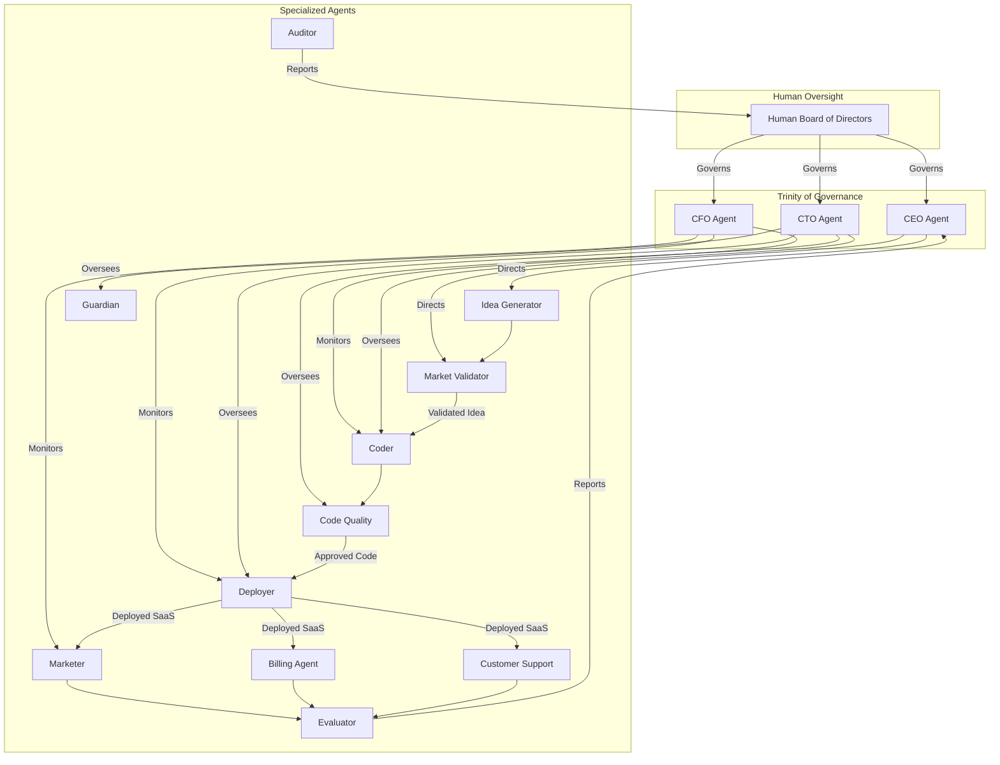

## 1. Agent Workflow Map (Fortified)

This document outlines the full diagram and textual breakdown of agent roles, memory, tool use, and collaboration within the meta-SaaS platform, updated to reflect the Fortified Strategy.

---

### Agent Roles

The platform is composed of a hierarchical structure of agents, with the Trinity of Governance agents at the top, overseeing the specialized operational agents.

#### The Trinity of Governance

*   **`CEO Agent` (Strategist):** Responsible for high-level business strategy, market analysis, and setting the overall direction.
*   **`CFO Agent` (Financial Governor):** Manages the budget, API costs, and revenue, with the power to approve or deny projects based on financial viability.
*   **`CTO Agent` (Technical Governor):** Oversees the technical strategy, including the choice of models, frameworks, and security protocols.

#### Specialized Agents

*   **`Guardian Agent` (Security):** A dedicated security agent that continuously audits all other agents and systems for vulnerabilities.
*   **`Auditor Agent` (Legal & Compliance):** Maintains immutable audit logs of all agent actions and decisions, ensuring compliance with legal and ethical guidelines.
*   **`Code Quality & Maintenance Agent`:** Works alongside the `Coder Agent` to run tests, perform static analysis, and handle refactoring and bug fixes.
*   **Idea Generator:** Brainstorms and proposes new SaaS product ideas.
*   **Market Validator:** Researches and validates the market potential of proposed ideas.
*   **Coder (Scaffolder):** Generates the initial codebase and application structure.
*   **Deployer:** Manages the deployment of applications to the cloud infrastructure.
*   **Marketer:** Handles SEO, social media marketing, and other promotional activities.
*   **Billing Agent:** Manages Stripe integration, subscriptions, and invoicing.
*   **Customer Support Agent:** Provides automated customer support and feedback analysis.
*   **Evaluator & Sunset Agent:** Monitors the performance of live SaaS products and decides whether to continue, improve, or sunset them.

### Collaboration and Orchestration

The agents are orchestrated in a hierarchical structure. The Trinity of Governance agents direct the activities of the specialized agents, which in turn collaborate through a shared memory system to execute their tasks.

