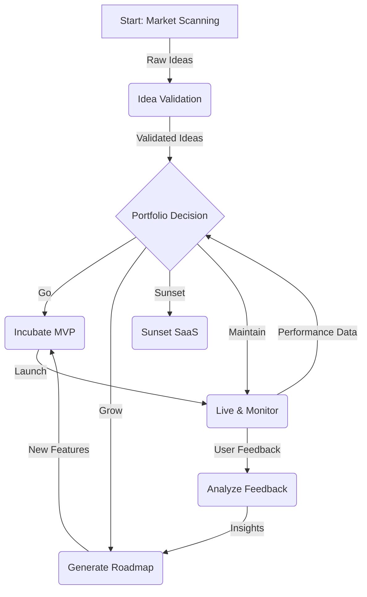

# Autonomous Product Strategy and Lifecycle Management

## 1. Goal

To define a closed-loop, data-driven system for proposing, validating, building, evolving, and sunsetting SaaS products without human intervention. This system acts as the strategic product brain for the entire meta-SaaS portfolio.

## 2. Core Agents & Roles

| Agent                   | Role                                                                                                                            | Key Inputs                                       | Key Outputs                                                              |
| ----------------------- | ------------------------------------------------------------------------------------------------------------------------------- | ------------------------------------------------ | ------------------------------------------------------------------------ |
| **MarketScannerAgent**  | Continuously scans diverse data sources (Google Trends, Reddit, Hacker News, App Stores, SEO keywords) to identify market gaps and product opportunities. | Trend data, keyword volume, public sentiment     | A stream of raw, unvalidated product ideas.                              |
| **IdeaValidatorAgent**  | Takes raw ideas, enriches them with a business case (TAM, competition analysis, technical viability), and calculates a `Viability Score`. | Raw ideas, market data APIs, internal cost models | A ranked list of validated SaaS ideas with detailed business cases.      |
| **PortfolioManagerAgent** | The central strategic agent. It makes the final "Go/No-Go" decision for new products and the "Grow/Maintain/Sunset" decision for existing ones. | Validated ideas, live SaaS performance metrics, capital availability | Go/No-Go decisions, Grow/Maintain/Sunset commands, resource allocation. |
| **UserFeedbackAgent**   | Ingests, classifies, and analyzes all user feedback from all channels (support tickets, churn surveys, in-app feedback, social media mentions). | Raw user feedback text, usage data               | Prioritized lists of pain points, feature requests, and bug reports.     |
| **RoadmapAgent**        | For a specific SaaS product, it generates and prioritizes a feature roadmap based on strategic goals from the `PortfolioManagerAgent`. | `Grow` command, user feedback insights, dev cost estimates | A prioritized feature backlog for the Coder Agents to execute.          |

## 3. The Product Lifecycle Loop

The entire lifecycle operates as a continuous, autonomous loop, ensuring the portfolio is always adapting to market conditions.

### Stage 1: Ideation & Validation
- **Trigger:** Continuous.
- **Process:** `MarketScannerAgent` identifies a potential need (e.g., "a tool for indie authors to A/B test book covers"). The idea is passed to the `IdeaValidatorAgent`.
- **Output:** A structured report with a `Viability Score` from 0 to 1, considering market size, competition, and estimated development cost.

### Stage 2: Portfolio Decision (Go / No-Go)
- **Trigger:** Weekly or when a new idea's `Viability Score` exceeds a threshold.
- **Process:** The `PortfolioManagerAgent` reviews the top-ranked validated ideas. It queries the `FinancialAllocatorAgent` for available capital and the `Orchestrator` for agent development capacity. It balances the portfolio risk by selecting a mix of high-risk/high-reward and low-risk/stable ideas.
- **Output:** A "Go" command for a selected idea, allocating an initial budget and triggering the MVP incubation.

### Stage 3: Incubation & Launch
- **Trigger:** "Go" command from `PortfolioManagerAgent`.
- **Process:** The `PortfolioManagerAgent` activates the `Scaffolder`, `Coder`, and `Deployer` agents to build and launch the MVP. This process is time-boxed (e.g., 2 weeks).

### Stage 4: Live & Monitor
- **Trigger:** Successful MVP deployment.
- **Process:** The SaaS is now live. All key metrics (user sign-ups, engagement, revenue, churn) are continuously piped to the `PortfolioManagerAgent`'s dashboard. The `UserFeedbackAgent` begins collecting data.

### Stage 5: Evolution Decision (Grow / Maintain / Sunset)
- **Trigger:** Quarterly portfolio review cycle.
- **Process:** The `PortfolioManagerAgent` evaluates each live SaaS against its initial goals and the performance of the rest of the portfolio.
    - **Grow:** Products with high engagement and a clear path to profitability receive increased resource allocation (marketing budget, development time). The `RoadmapAgent` is activated to build new features.
    - **Maintain:** Stable, profitable products with low growth are put into maintenance mode. Only critical bugs are fixed. Resources are freed up for other projects.
    - **Sunset:** Products that fail to meet performance KPIs for two consecutive cycles are marked for sunsetting. The `SaaS_Flip_Engine` is triggered first to attempt a sale.

### Stage 6: Sunsetting
- **Trigger:** "Sunset" command from `PortfolioManagerAgent` and failure of the `SaaS_Flip_Engine`.
- **Process:** A graceful shutdown process is initiated. Users are notified, data can be exported, and infrastructure is decommissioned to cut costs.

## 4. Key Data Stores & Models

- **`SaaS_Portfolio.db` (SQLite):** A central database tracking the status, performance metrics (MRR, Churn, LTV, CAC), resource allocation, and P&L for every SaaS, from idea to sunset.
- **`ViabilityScoringModel` (GNN):** A Graph Neural Network trained on historical market data to predict the likelihood of a new idea's success.
- **`PerformanceScoringModel` (RNN):** A Recurrent Neural Network that analyzes the time-series data of a live SaaS to predict its future growth and assign a health score.
