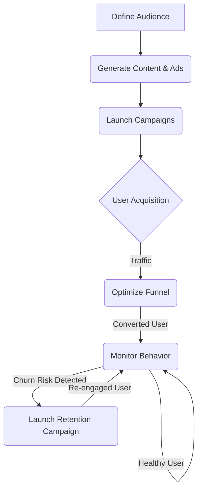

# Autonomous Customer Acquisition and Growth Engine

## 1. Goal

To define a fully autonomous, multi-channel engine for acquiring, converting, and retaining customers across the entire SaaS portfolio. This system replaces the function of a human marketing and growth team.

## 2. Core Agents & Roles

| Agent                     | Role                                                                                                                                        | Key Inputs                                         | Key Outputs                                                              |
| ------------------------- | ------------------------------------------------------------------------------------------------------------------------------------------- | -------------------------------------------------- | ------------------------------------------------------------------------ |
| **MarketSegmentAgent**    | For each SaaS, identifies and defines target customer personas, including their demographics, pain points, and online habitats (e.g., subreddits, forums). | Product description, market research data          | A detailed `CustomerPersona.json` document.                              |
| **ContentCreatorAgent**   | Generates all marketing assets tailored to specific personas and channels: ad copy, landing pages, blog posts, social media updates, and email copy. | `CustomerPersona.json`, campaign goals             | A repository of marketing assets.                                        |
| **CampaignManagerAgent**  | Designs, executes, and manages marketing campaigns across multiple channels (Google Ads, Reddit Ads, SEO, Content Marketing). Manages budgets. | Campaign goals, budget from `FinancialAllocatorAgent` | Live campaigns, performance dashboards, budget allocation adjustments.    |
| **FunnelOptimizerAgent**  | Relentlessly A/B tests every step of the customer acquisition funnel, from ad click-through rates to landing page conversion and user onboarding. | Live campaign data, user behavior events           | Optimized funnels with higher conversion rates.                          |
| **ChurnPredictionAgent**  | Analyzes user behavior to identify at-risk users who are likely to churn.                                                                   | User engagement data (last login, feature usage)   | A list of users flagged as `at_risk` with a churn probability score.     |
| **RetentionCampaignAgent**| Acts on churn predictions by launching personalized, automated retention campaigns to re-engage at-risk users.                                | `at_risk` user list                                | Executed retention campaigns (e.g., emails, special offers, surveys).    |

## 3. The Customer Lifecycle Funnel

The engine manages the entire customer journey as a continuous, self-optimizing loop.

### Phase 1: Audience & Campaign Setup
- **Trigger:** A new SaaS is moved to the "Grow" stage by the `PortfolioManagerAgent`.
- **Process:**
    1. The `MarketSegmentAgent` analyzes the product and its target market to generate detailed customer personas.
    2. The `CampaignManagerAgent` requests an initial customer acquisition budget from the `FinancialAllocatorAgent`.
    3. The `ContentCreatorAgent` generates a set of initial marketing assets (landing pages, ad variants) for each persona.
- **Output:** A fully configured marketing campaign ready for launch.

### Phase 2: Acquisition & Optimization
- **Trigger:** Campaign is ready for launch.
- **Process:**
    1. The `CampaignManagerAgent` launches the campaigns across selected channels (e.g., Google Ads, Reddit).
    2. The `FunnelOptimizerAgent` immediately begins A/B testing ad copy, headlines, and calls-to-action using a multi-armed bandit model to quickly find winning variants.
    3. All performance data (impressions, clicks, conversions, Cost Per Acquisition - CAC) is tracked in real-time.
- **Output:** A steady stream of new trial/freemium users.

### Phase 3: Performance-Based Budgeting
- **Trigger:** Continuous, real-time.
- **Process:** The `CampaignManagerAgent` constantly analyzes the CAC and conversion rate from each channel. It autonomously shifts the budget towards the best-performing channels and cuts spending on underperforming ones.
- **Output:** An optimized marketing spend that maximizes user acquisition for the lowest possible CAC.

### Phase 4: Retention & Re-engagement Loop
- **Trigger:** A user's behavior pattern matches a high-churn-risk profile.
- **Process:**
    1. The `ChurnPredictionAgent` flags the user account.
    2. The `RetentionCampaignAgent` is activated. It selects the best intervention from a playbook (e.g., a personalized email highlighting an unused feature, a survey asking for feedback, or a limited-time discount offer).
    3. The intervention is executed automatically. The user's subsequent behavior is monitored to see if the intervention was successful.
- **Output:** Reduced customer churn and increased Lifetime Value (LTV).

## 4. Key Data Stores & Models

- **`CustomerProfile.db` (SQLite):** Stores user data, including their assigned persona, interaction history with marketing campaigns, and in-app behavior.
- **`MarketingPerformance.db` (TimescaleDB):** A time-series database that stores all marketing and funnel metrics for real-time analysis and dashboarding.
- **`MultiArmedBanditModel`:** The core model for the `FunnelOptimizerAgent`. It allows for rapid, statistically significant A/B testing with minimal regret.
- **`ChurnPredictionModel` (XGBoost):** A gradient-boosted model trained on historical user data to predict churn probability based on behavioral features.
