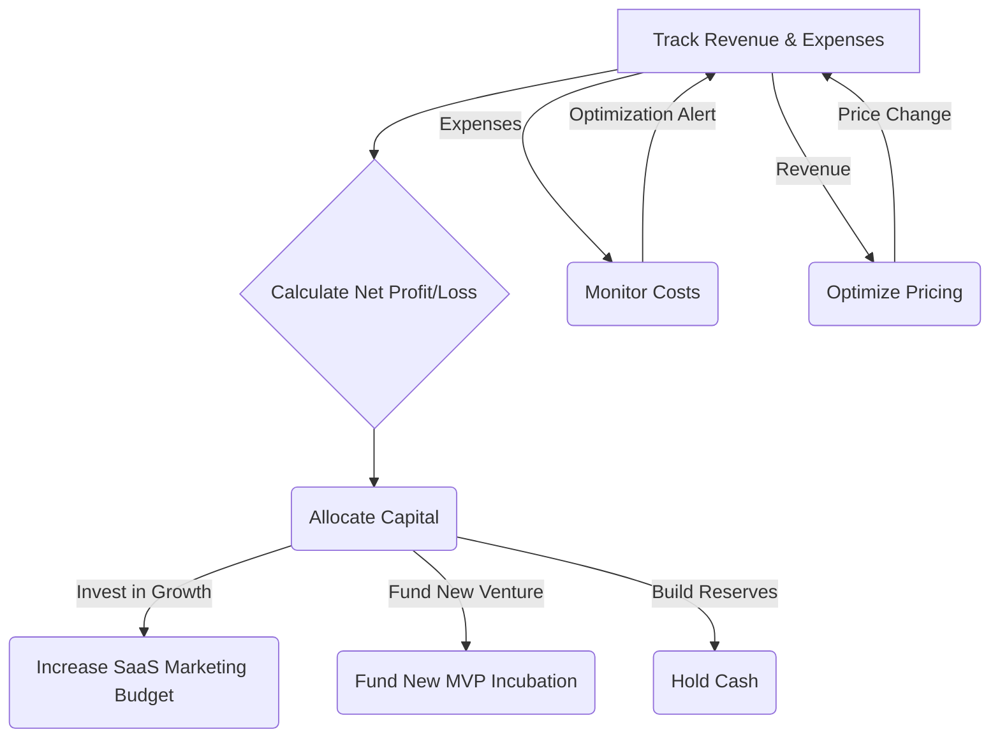

# Autonomous Financial Strategy and Capital Allocation

## 1. Goal

To define the autonomous financial core of the business, responsible for managing capital, controlling costs, optimizing revenue, and making strategic investment decisions to maximize the entire portfolio's value. This system acts as the AI-CFO.

## 2. Core Agents & Roles

| Agent                     | Role                                                                                                                                                           | Key Inputs                                                     | Key Outputs                                                              |
| ------------------------- | -------------------------------------------------------------------------------------------------------------------------------------------------------------- | -------------------------------------------------------------- | ------------------------------------------------------------------------ |
| **FinancialAnalystAgent** | The central financial agent. It monitors all revenue and expenses in real-time, maintains the portfolio's P&L, and ensures operational solvency (i.e., bills are paid). | Bank/Stripe API feeds, expense reports from other agents       | Real-time P&L dashboard, cash flow statements, solvency alerts.          |
| **CostControlAgent**      | Monitors all operational costs—cloud hosting (AWS/Hetzner), API calls (OpenAI), and ad spend—to identify waste and suggest optimizations.                          | Cloud billing APIs, API usage logs, campaign performance data | Cost-saving recommendations, budget variance alerts.                     |
| **RevenueAndPricingAgent**| Manages pricing for all SaaS products. It runs pricing experiments and analyzes market data to find the optimal price points that maximize LTV and revenue.      | User segmentation data, competitor pricing, usage metrics      | Dynamic pricing adjustments, A/B test results on pricing.                |
| **CapitalAllocatorAgent** | The strategic financial brain. On a set cadence, it decides how to allocate net profits based on a configurable policy, balancing growth, new ventures, and risk. | Net profit/loss data, `PortfolioManagerAgent` recommendations | Capital allocation directives (e.g., "Allocate $5k to marketing for SaaS-A"). |

## 3. Core Financial Loops

These loops ensure the business remains financially healthy and strategically invests its capital for maximum growth.



### Loop 1: Real-Time Accounting & Solvency
- **Trigger:** Continuous.
- **Process:** The `FinancialAnalystAgent` ingests data from all financial APIs (Stripe for revenue, AWS/Hetzner billing for costs, etc.). It categorizes every transaction and updates the master ledger. If cash reserves fall below a critical threshold (e.g., 3 months of operating expenses), it issues a high-priority alert to all other strategic agents to cut costs.
- **Output:** A perpetually up-to-date view of the company's financial health.

### Loop 2: Cost Control
- **Trigger:** Continuous.
- **Process:** The `CostControlAgent` analyzes expense data. If it detects an anomaly (e.g., API costs for a specific SaaS spike by 50% overnight), it alerts the `PortfolioManagerAgent`. It also provides regular reports on cost-saving opportunities (e.g., "Switching to ARM-based servers for SaaS-B could save 20% on hosting").
- **Output:** A leaner, more efficient operation with lower overhead.

### Loop 3: Revenue & Pricing Optimization
- **Trigger:** On a regular cadence or when a SaaS reaches a certain user milestone.
- **Process:** The `RevenueAndPricingAgent` analyzes the value metrics for a SaaS (which features are used most by which customer segments). It designs and runs pricing experiments (e.g., testing a new "Pro" tier) on a small subset of new users to measure the impact on conversion rate and LTV.
- **Output:** Optimized pricing that maximizes revenue without alienating customers.

### Loop 4: The Capital Allocation Cycle
- **Trigger:** Monthly.
- **Process:**
    1. The `FinancialAnalystAgent` finalizes the P&L for the previous month and reports the net profit or loss.
    2. The `CapitalAllocatorAgent` ingests this number and applies the **Capital Allocation Policy**. It also requests recommendations from the `PortfolioManagerAgent` (e.g., "Which SaaS has the highest growth potential right now?").
    3. Based on the policy and recommendations, it issues directives. For example, if the policy is `60% Reinvest, 30% New Ventures, 10% Reserves`, it will automatically transfer 60% of profits to the marketing/dev budget for top-performing products.
- **Output:** Strategic, data-driven investment decisions that fuel the company's growth flywheel.

## 4. Key Data, Models, and Policies

- **`MasterLedger.db` (Immutable Log):** The single source of truth for all financial transactions. Structured like a blockchain for auditability.
- **`CashFlowProjectionModel` (ARIMA):** A time-series model that forecasts near-term cash flow to anticipate future solvency issues.
- **`CapitalAllocationPolicy.json`:** A configurable file that defines the company's investment strategy. This is the primary lever for a human owner to steer the company's high-level financial direction without managing it directly.
    ```json
    {
      "policy_name": "Aggressive Growth",
      "allocations": {
        "reinvest_growth": 0.60,
        "fund_new_ventures": 0.30,
        "cash_reserves": 0.10,
        "profit_distribution": 0.00
      }
    }
    ```
