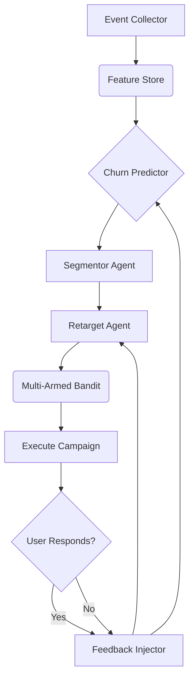

## 7. Auto Churn Detection & Retargeting Engine

This document provides a detailed overview of the Auto Churn Detection & Retargeting Engine, which is designed to detect user churn behavior before it occurs and launch automated, AI-driven personalized campaigns to retain users.

---

### 🌐 Goal

To detect user churn behavior _before_ it occurs and launch automated, AI-driven personalized campaigns across multiple channels (email, push, in-app, ad retargeting) without human intervention.

### ⚙️ Workflow & Architecture

The engine operates as a continuous, self-optimizing loop:

### 🧩 Detailed Component Breakdown

#### 1. Event Collector (`event_collector.rb`)

*   **Responsibility:** A background job (`SolidQueue`) that listens for and processes user interaction events from all spawned SaaS products.
*   **Events Tracked:** `user_signed_in`, `feature_used`, `page_viewed`, `support_ticket_opened`, `billing_page_viewed`, `subscription_cancelled`, `session_duration_seconds`.
*   **Data Enrichment:** Adds metadata to each event, such as `user_archetype` (e.g., "new", "power_user"), `time_since_last_event`, and `is_on_trial`.

#### 2. Feature Store (`features.parquet`)

*   **Responsibility:** Stores featurized user behavior in a queryable format (e.g., Parquet file in S3 or a DuckDB instance) for model training.
*   **Example Features:** `login_frequency_last_7d`, `avg_session_duration_last_30d`, `feature_X_usage_last_7d`, `days_since_last_login`, `support_tickets_opened_last_30d`.

#### 3. Churn Predictor (`churn_predictor.rb`)

*   **Responsibility:** A lightweight, retrainable model that assigns a `churn_risk_score` (0.0 to 1.0) to every active user daily.
*   **Model:** Starts with a simple **Logistic Regression** model for interpretability, which can be upgraded to XGBoost or a small neural network.
*   **Trigger:** A daily cron job (`rake churn:predict_all`) runs the prediction for all users.
*   **Output:** Updates the `User` model with `churn_risk_score` and `last_churn_prediction_at`.

#### 4. Segmentor Agent (`segmentor_agent.rb`)

*   **Responsibility:** Groups high-risk users into actionable micro-segments.
*   **Input:** Users with `churn_risk_score > 0.7`.
*   **Action:** Uses **K-Means clustering** on the feature store data for these users.
*   **Prompt:** "Based on these user clusters, generate a human-readable name and a 1-sentence description for each segment. For example: 'Weekend Warriors who haven't used the reporting feature'."
*   **Output:** Creates segment descriptions like `segment_1_description.txt`.

#### 5. Retarget Agent (`retarget_agent.rb`)

*   **Responsibility:** Designs and launches a personalized retention campaign for each high-risk segment.
*   **Input:** A segment description.
*   **Prompt:** "You are a world-class retention marketer. For the user segment '{segment_description}', generate 3 distinct retention campaign angles. For each angle, provide: `channel`, `subject_line`/`headline`, `body_copy`, and `cta_text`."
*   **Output:** A structured JSON of campaign variants.

#### 6. Multi-Armed Bandit (`multiarmed_bandit.rb`)

*   **Responsibility:** Ensures the best campaign wins by automatically A/B testing variants.
*   **Algorithm:** Uses **Thompson Sampling** to balance exploration (trying new campaigns) and exploitation (using the current best-performing one).
*   **Logic:** When the `Retarget Agent` generates campaign variants, the bandit allocates traffic to the variant most likely to succeed based on its `win_rate`.

#### 7. Feedback Injector (`feedback_injector.rb`)

*   **Responsibility:** Closes the learning loop by feeding campaign results back into the system.
*   **Input:** Campaign results (impressions, clicks, conversions).
*   **Action:**
    *   For the **Churn Predictor:** If a user churns despite a campaign, their feature set is flagged as a high-priority training example.
    *   For the **Retarget Agent:** The prompt, generated copy, and success rate are saved to the `memory/` store to improve future campaign generation (RAG).
